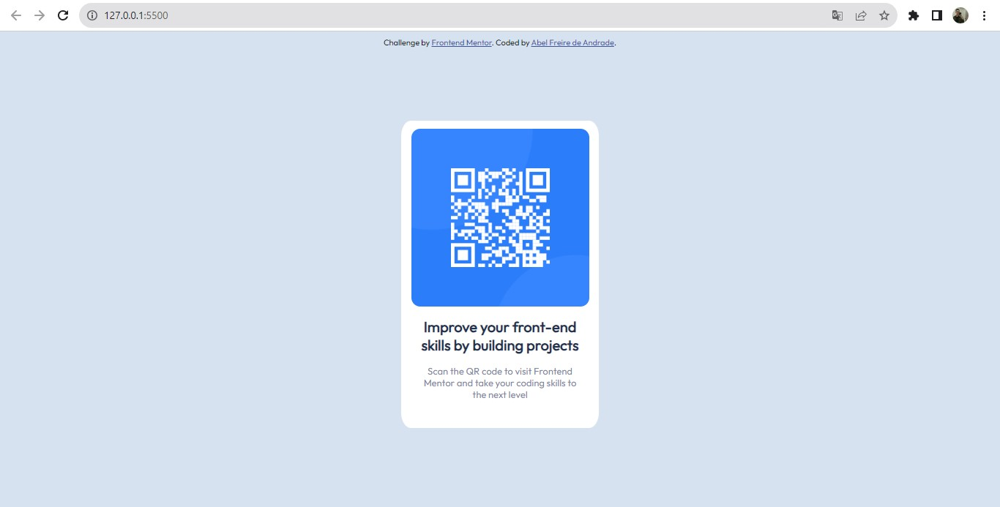

# Frontend Mentor - QR code component solution

This is a solution to the [QR code component challenge on Frontend Mentor](https://www.frontendmentor.io/challenges/qr-code-component-iux_sIO_H). Frontend Mentor challenges help you improve your coding skills by building realistic projects. 

## Table of contents

- [Overview](#overview)
  - [Screenshot](#screenshot)
  - [Links](#links)
- [My process](#my-process)
  - [Built with](#built-with)
  - [What I learned](#what-i-learned)
  - [Continued development](#continued-development)
  - [Useful resources](#useful-resources)
- [Author](#author)
- [Acknowledgments](#acknowledgments)

## Overview

###  Screenshot

- Web version

- Mobile version
  

### Links

- Solution URL: [https://github.com/abelandrad/QrCodeComponentSolution.git](https://github.com/abelandrad/QrCodeComponentSolution.git)
- Live Site URL: [https://abelandrad.github.io/QrCodeComponentSolution/](https://abelandrad.github.io/QrCodeComponentSolution/)

## My process

### Built with

- Semantic HTML5 markup
- CSS custom properties
- Flexbox
- CSS Grid
- Mobile-first workflow

## Author

- Linkedin - [Abel Andrade](https://www.linkedin.com/in/abelandradeufam/)
- Frontend Mentor - [@abelandrad](https://www.frontendmentor.io/profile/abelandrad)
- Instagram - [@abelandrade_](https://www.instagram.com/abelandrade_/)
